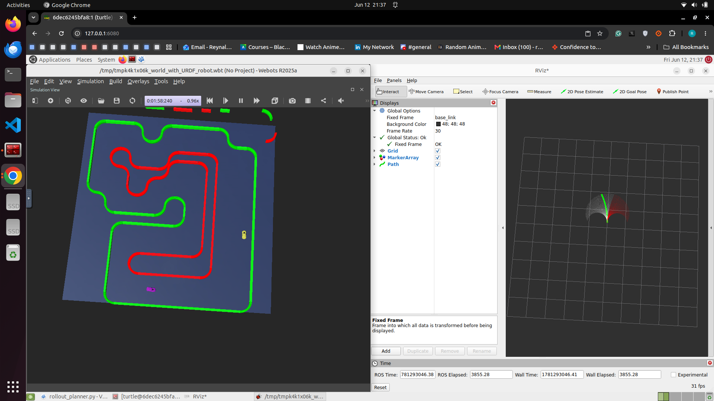

# ROS2 Autonomous Racing Planner

This project contains a ROS2 autonomous racing planner for an Ackermann steering race car.

The planner uses a 2D LiDAR scan to generate candidate rollout trajectories, score them, select the best trajectory, and publish steering and speed commands to the car.


## Demo

### Simulation and RViz Preview



### Demo Video

[Watch the demo video](media/demo_playable.mp4)

## Features

- ROS2 Python planner node
- LiDAR-based local planning
- MPPI/rollout-style trajectory selection
- Ackermann steering command output
- Dynamic horizon depending on track openness
- RViz visualization of candidate rollouts
- Best path visualization
- Real-car kick-start speed boost for motor deadband
- LiDAR orientation correction for real hardware

## Package structure

```text
race_autonomy/
├── package.xml
├── setup.py
├── setup.cfg
├── resource/
├── test/
└── race_autonomy/
    ├── __init__.py
    └── rollout_planner.py
